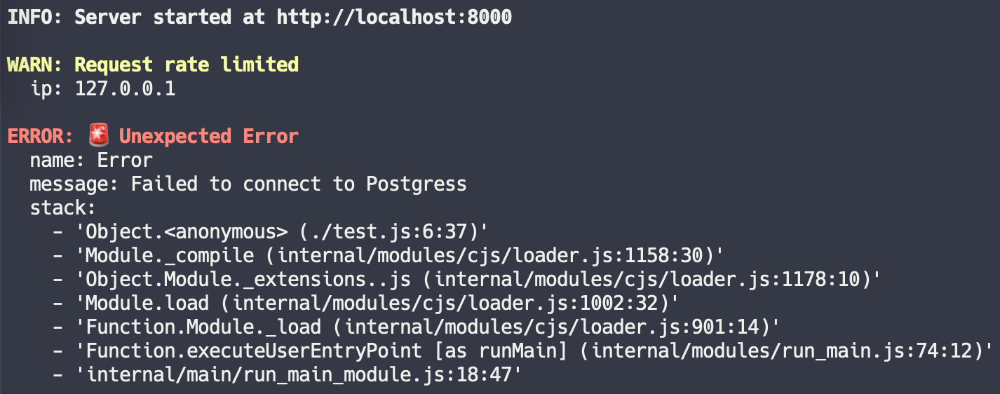

# ecs-logs-js

A simple Node.js console logger that outputs human friendly messages in development and [ecs-logs](https://github.com/segmentio/ecs-logs) compatible messages in production. Supports all object types, including those that can't be JSON stringified like Error, Map, Set and BigInt.

TypeScript types are also included in the package.



## Install

```shell
yarn add ecs-logs-js
# or
npm install ecs-logs-js
```

## Usage

```js
import { Logger } from 'ecs-logs-js'

const logger = new Logger()
logger.info('Server started at http://localhost:8000')
logger.warn('Request rate limited', { ip: '127.0.0.1' })
logger.error('🚨 Unexpected Error', new Error('Failed to connect to Postgress'))
```

## API

## Development
